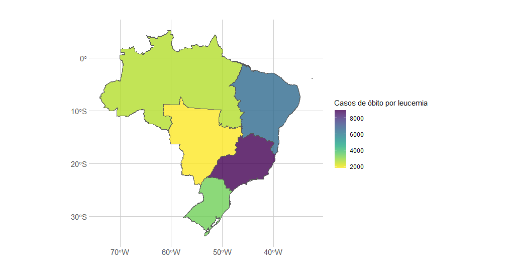

```{r setup, include=FALSE}
knitr::opts_chunk$set(echo = TRUE)
```

O câncer na infância e adolescência é um grave problema de saúde pública. A
incidência da doença nesse grupo etário é responsável por 2 a 3% de todos os cânceres ocorridos no Brasil. É uma doença menos frequente em crianças que em adultos, porém, com grande impacto social desde que afeta a família como um todo.

Este relatório descritivo tem como objetivo descrever a tendência e a magnitude da mortalidade da leucemia na infância e na adolescência nas regiões do Brasil, entre os anos de 1996 a 2020. Deseja-se, também, analisar a distribuição espacial dos casos de mortalidade por leucemia nesse grupo etário nas regiões brasileiras.

```{r, include=FALSE, message=FALSE, warning=FALSE}
library(readxl)
library(tidyverse)
library(viridis)
library(sf)

menor_1 <- read_excel("menor_1.xlsx", 
                      col_types = c("text", "numeric", "numeric", 
                                    "text"))

um_quatro <- read_excel("um_quatro.xlsx", 
                        col_types = c("text", "numeric", "numeric", 
                                      "text"))

cinco_nove <- read_excel("cinco_nove.xlsx", 
                         col_types = c("text", "numeric", "numeric", 
                                       "text"))

dez_quatorze <- read_excel("dez_quatorze.xlsx", 
                           col_types = c("text", "numeric", "numeric", 
                                         "text"))

quinze_dezenove <- read_excel("quinze_dezenove.xlsx", 
                              col_types = c("text", "numeric", "numeric", 
                                            "text"))

dados2<- rbind(menor_1, um_quatro, cinco_nove, dez_quatorze, quinze_dezenove)

dados2 <- na.exclude(dados2) #Exclui NA

dados2 <- dados2 %>%
  separate(`Macrorregião de Saúde`, c("regiao", "macrorregiao")) %>%
  mutate(
    regiao = case_when(
      regiao = 1101 & regiao <= 1702 ~ "Norte",
      regiao = 2109 & regiao <= 2918 ~ "Nordeste",
      regiao = 3101 & regiao <= 3534 ~ "Sudeste",
      regiao = 4105 & regiao <= 4314 ~ "Sul",
      regiao = 5005 & regiao <= 5305 ~ "Centro-Oeste")) 

```

A quantidade de óbitos por leucemia, na infância e na adolescência, oscilou minimamente entre os anos de 1996 a 2020. Ao longo desses 25 anos analisados, o ano de 2003 foi o que teve uma maior quantidade de óbitos por leucemia infantil, com 1019 casos registrados, enquanto que o ano de 2020 teve o menor registro de casos de leucemia infantil. 

```{r, echo=FALSE, warning=FALSE, message=FALSE, fig.cap= "Óbitos por ano"}
### Agrupa por ano
dados_agrupados <- dados2 %>%
  group_by(ano) %>%
  summarise(casos_soma = sum(casos))

ggplot(dados_agrupados, aes(ano, casos_soma))+
  geom_line(color = "purple", size = 0.6) +
  theme_minimal() +
  labs(x = "Ano",
       y = "Casos de óbito por leucemia")
```

Pela `Figura 1`, é possível perceber que foram registrados 890 óbitos em 1996 e 732 casos de óbito em 2020. Essa redução nos registros de óbitos por leucemia em 2020, não significa que, realmente, uma menor quantidade de crianças e adolescentes foram mortos pela doença, pode haver uma sequência de fatores que justifiquem isso, inclusive a pandemia da Covid-19.

Um fator interessante a ser considerado é a faixa etária das crianças e adolescentes que tiveram óbito por leucemia. Ao observar a `Figura 2` abaixo, é possível perceber que os bebês menores de 1 ano de idade foram os que tiveram uma menor quantidade de registros por óbitos.

```{r, echo=FALSE, warning=FALSE, message=FALSE, fig.cap="Evolução dos óbitos por faixa etária"}
###Agrupa por faixa_etaria
dados_agrupados1 <- dados2 %>%
  group_by(faixa_etaria, ano) %>%
  summarise(casos_soma = sum(casos))

ggplot(dados_agrupados1, aes(ano, casos_soma, color = faixa_etaria))+
  geom_line(size = 0.6) +
  theme_minimal() +
  labs(x = "Ano",
       y = "Casos de óbito por leucemia",
       color = "Faixa etária") +
  scale_color_discrete(breaks = c("menor que 1", "1-4 anos", "5-9 anos",
                                  "10-14 anos",
                                  "15-19 anos"),
                       labels = c("< 1", "1 a 4 anos",
                                  "5 a 9 anos", "10 a 14 anos", "15 a 19 anos"))

```

Ao longo dos anos analisados, houveram 954 registros totais de óbitos por leucemia em crianças menores de 1 ano de idade, enquanto que para crianças entre 1 a 4 anos houveram 4.722 registros de óbitos por leucemia, já entre as idades de 5 a 9 anos houveram 5.490 casos de óbitos e entre 10 a 14 anos 5.665 casos e entre 15 a 19 anos 6.499 casos de óbito, com 27.9 % dos casos totais.


Faixa etária    | Casos  | %   |
 :---:          | :---:  |:---:|
menor que 1     | 954    |4.1  |
1 a 4 anos      | 4722   |20.2 |
5 a 9 anos      | 5490   |23.5 |
10 a 14 anos    | 5665   |24.3 |
15 a 19 anos    | 6499   |27.9 |


Entre 1996 e 2020 houve uma redução nos casos de óbitos na região Sudeste, enquanto na região Nordeste os óbitos só auentaram ao longo dos anos. Já nas regiões Norte, Sul e Centro-oeste, houve poucas oscilações no número de óbitos.


```{r, echo=FALSE, message=FALSE, warning=FALSE, fig.cap= "Evolução dos óbitos por região"}
###Agrupa por regiao
dados_agrupados2 <- dados2 %>%
  group_by(regiao, ano) %>%
  summarise(casos_soma = sum(casos))

ggplot(dados_agrupados2, aes(ano, casos_soma, color = regiao))+
  geom_line(size = 0.6) +
  theme_minimal() +
  labs(x = "Ano",
       y = "Casos de óbito por leucemia",
       color = "Região do Brasil") +
  scale_y_continuous(
    limits = c(0, 450),
    breaks = seq(0, 450, 50)
  )
```

Com 38.5 % das observações totais, a região Sudeste é a que possui o maior número de óbitos totais, em seguida o Nordeste com 28.0 % dos óbitos totais, e a região com o menor registro de óbitos por leucemia infantil é a região Centro-Oeste com apenas 7.80 % dos casos. 


Regiões do Brasil| Casos | %   |
   :---:        | :---:  |:---:|
Norte           | 2625   |11.3|
Nordeste        | 6542   |28.0 |
Centro-Oeste    | 1820   |7.80 |
Sudeste         | 8972   |38.5 |
Sul             | 3371   |14.4 |


Visualizando o mapa do Brasil com os casos de óbitos por região, fica claro que  a região Sudeste é a que possui o maior registro com 8972 mortes, enquanto a região Centro-Oeste é a que possui a menor quantidade de casos registrados com 1820 óbitos entre 1996 a 2020.




Segue abaixo o percentual do número de casos por faixa etária e região:

Faixa etária/Região    | Norte  | Nordeste | Centro-Oeste | Sudeste | Sul|
 :---:                 | :---:  |:---:     |:---:         |:---:    |:---:|
menor que 1            | 13.41  |33.33     |7.86          |33.64    |11.74|
1 a 4 anos             | 13.08  |28.37     |7.81          |36.93    |13.78|
5 a 9 anos             | 12.58  |27.66     |8.25          |37.06    |14.42|
10 a 14 anos           | 10.50  |28.10     |7.48          |39.39    |14.51|
15 a 19 anos           |  9.12  |27.28     |7.67          |40.62    |15.29|

